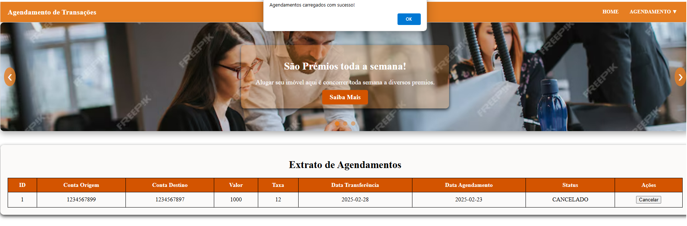

# Agendamento de Transações - Frontend

Este projeto é o frontend do sistema de Agendamento de Transações, desenvolvido em Angular. O sistema permite que os usuários agendem transações financeiras, consultem transações agendadas e gerenciem suas movimentações de forma intuitiva.

## Requisitos

Node.js instalado (versão recomendada: 18 ou superior)

Angular CLI instalado globalmente (npm install -g @angular/cli)

## Como executar o projeto

No diretório raiz do projeto, execute o script serve.bat para iniciar o servidor de desenvolvimento:

`serve`

Acesse o sistema no navegador pelo endereço:

`http://localhost:4200/`

O sistema será recarregado automaticamente a cada alteração nos arquivos-fonte.

## Estrutura do Projeto

1 Tela de Cadastro de Transação: Permite ao usuário cadastrar novas transações, informando dados como valor, data e tipo de transação.

2 Tela de Consulta de Transações: Exibe uma lista das transações agendadas, permitindo filtragem por data, tipo ou valor.

### Tela de Cadastro de Transação

### Tela de Consulta de Transações
